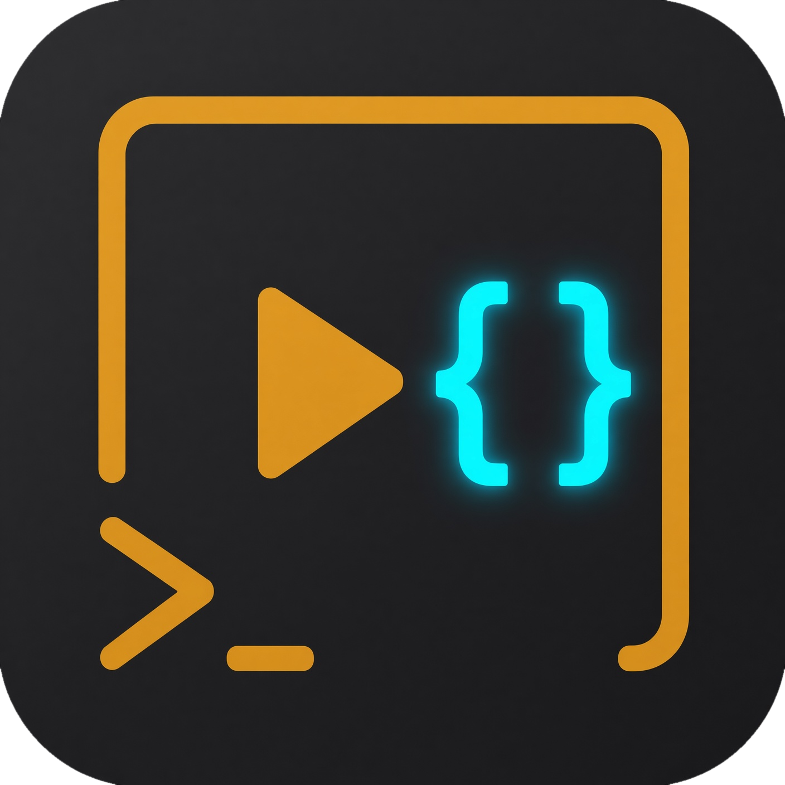

<!-- prettier-ignore -->
<div align="center">



# ave

*Typed ffmpeg for agents. JSON on stdout.*

[](https://www.rust-lang.org)
[](https://ffmpeg.org)
[](https://crates.io/crates/agent-video-editor)

[Getting started](#getting-started) • [Usage](#usage) • [Commands](#commands) • [Agent skill](#agent-skill)

</div>

`ave` runs everyday video edits by spawning the `ffmpeg` and `ffprobe` binaries on your PATH. You pass typed subcommands. It prints a JSON envelope. It does not link libav.

Agents kept inventing ffmpeg flags. This CLI is the recipes from a video-edit skill, with clap in front and JSON out the back.

## Features

- Verbs for trim, concat, resize, speed, extract/replace audio, overlay, compress, and convert
- `--dry-run` prints the exact ffmpeg argv and writes nothing
- `ave run plan.json` for multi-step jobs (cut a middle, trim then resize, …)
- Stream-copy when the files already match; re-encode only when the op needs it
- Refuses in-place edits and never deletes inputs
- JSON on stdout, including failures (`ok`, `error`, non-zero exit)

> [!TIP]
> `ave info clip.mp4` first, then `--dry-run`. The `ffmpeg` array in the JSON is the command that would run.

## Getting started

### Prerequisites

- [Rust](https://rustup.rs) 1.85+ (edition 2024)
- [ffmpeg](https://ffmpeg.org) (includes `ffprobe`)

```bash
# macOS
brew install ffmpeg

# Debian / Ubuntu
sudo apt install ffmpeg
```

### Install

From crates.io:

```bash
cargo install agent-video-editor
ave doctor
```

From this repo:

```bash
cargo install --path .
ave doctor
```

From Git:

```bash
cargo install --git https://github.com/MatheusBBarni/agent-video-editor --locked
ave doctor
```

The binary is `~/.cargo/bin/ave`. `doctor` should print `"ok": true`. If it does not, ffmpeg is not on PATH. Pass `--ffmpeg` / `--ffprobe`, or fix the install.

## Usage

Always pass `-o`. ave will not overwrite the input.

```bash
ave info clip.mp4
ave trim clip.mp4 --from 30 --to 105 -o keep.mp4 --dry-run
ave trim clip.mp4 --from 30 --to 105 -o keep.mp4
ave resize keep.mp4 --preset tiktok -o short.mp4
```

Several steps in one go:

```bash
ave run plan.json
ave run - < plan.json
```

```json
{
  "steps": [
    {"op": "trim", "input": "in.mp4", "from": "0", "to": "12", "output": "a.mp4"},
    {"op": "trim", "input": "in.mp4", "from": "18", "to": "120", "output": "b.mp4"},
    {"op": "concat", "inputs": ["a.mp4", "b.mp4"], "output": "out.mp4"}
  ]
}
```

Paths are relative to the current directory. A later step may use an earlier `output` as its input. If a step fails, ave stops and keeps whatever it already wrote.

> [!IMPORTANT]
> Mutating commands require `-o`. The same path as an input is rejected. Existing **outputs** are overwritten unless you pass `--no-overwrite`.

### Global flags

```
ave [--dry-run] [--copy-only] [--no-overwrite]
    [--ffmpeg PATH] [--ffprobe PATH]
    <COMMAND>
```

| Flag | Meaning |
| --- | --- |
| `--dry-run` | Validate and print argv. Write nothing |
| `--copy-only` | Fail if the op would re-encode |
| `--no-overwrite` | Fail if the output file already exists |
| `--ffmpeg` / `--ffprobe` | Override the binaries |

Timestamps: `HH:MM:SS`, `MM:SS`, or seconds (`90`, `90.5`).

## Commands

| Command | What it does |
| --- | --- |
| `info` | Probe duration, coded size, codecs, fps, audio, rotation, display size |
| `doctor` | Check ffmpeg / ffprobe |
| `trim` | Cut a range with `--to` or `--duration`. `--accurate` re-encodes for frame-accurate in/out |
| `concat` | Join clips. Copies when codec, size, fps, and rotation match; re-encodes when they don't |
| `resize` | `--preset tiktok`, `youtube`, `twitter`, `instagram`, or `square`. Pads, does not stretch |
| `speed` | `--factor 2` is twice as fast, `0.5` is half |
| `extract-audio` | Pull audio. Format from `--format` or the output extension |
| `replace-audio` | `--mute`, `--audio FILE`, or `--mix FILE` |
| `overlay` | Logo/image. `--position top-right` (default), `top-left`, `bottom-left`, `bottom-right`, `center` |
| `compress` | CRF 23, preset `medium` unless you pass `--crf` / `--preset` |
| `convert` | Container from the output extension. `.gif` is a two-pass palette |
| `run` | JSON plan, or `-` for stdin |
| `install-skill` | Install the agent skill into one provider folder; symlink the rest |

Resize presets: tiktok 1080×1920, youtube/twitter 1920×1080, instagram 1080×1350, square 1080×1080.

Trim and concat copy streams when they can. Resize, speed, overlay, compress, and GIF convert always re-encode.

This will not color grade, burn captions, cut a multi-cam show, or upload to YouTube.

More examples: [`skills/ave/references/commands.md`](skills/ave/references/commands.md). Plan fields: [`skills/ave/references/plans.md`](skills/ave/references/plans.md).

## Agent skill

The skill lives in this repo at [`skills/ave/`](skills/ave/SKILL.md). Install it into the agent folders you use. The first `--provider` (or `--dir`) gets the files; the rest get a symlink to that folder:

```bash
ave install-skill --provider claude
ave install-skill --provider claude,pi,agents
ave install-skill --provider all --global
```

| Provider | Project | `--global` |
| --- | --- | --- |
| `agents` | `.agents/skills` | `~/.agents/skills` |
| `claude` | `.claude/skills` | `~/.claude/skills` |
| `pi` | `.pi/agent/skills` | `~/.pi/agent/skills` |
| `cursor` | `.cursor/skills` | `~/.cursor/skills` |
| `all` | those four | those four under `~/` |

`--dir DIR` writes `DIR/ave` and ignores providers. Extra `--dir` values become symlinks to the first. No `--provider` and no `--dir` prints the list and exits 1.

> [!NOTE]
> After `cargo install`, re-run `ave install-skill` if you change the skill files. The binary embeds a copy at compile time.
